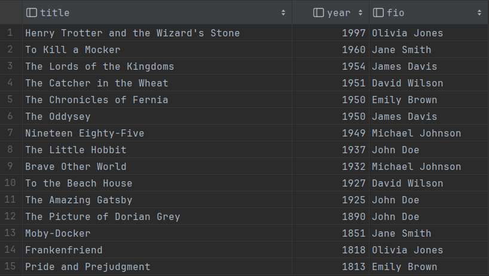

### Диаграмма базы


### Создание базы данных
```sql
CREATE DATABASE javaguru;
CREATE SCHEMA library;
```

### Создание таблиц
```sql
CREATE TABLE books
(
    id        bigserial PRIMARY KEY,
    title     varchar(80) NOT NULL,
    year      smallint,
    pages     smallint,
    author_id bigint REFERENCES authors (id) ON DELETE CASCADE
);
```

```sql
CREATE TABLE authors
(
    id      bigserial PRIMARY KEY,
    name    varchar(40) NOT NULL,
    surname varchar(40) NOT NULL
);
```

### Заполнение таблиц данными
```sql
INSERT INTO authors (name, surname)
VALUES ('John', 'Doe'),
       ('Jane', 'Smith'),
       ('Michael', 'Johnson'),
       ('Emily', 'Brown'),
       ('David', 'Wilson'),
       ('Olivia', 'Jones'),
       ('James', 'Davis');
```


```sql
INSERT INTO books (title, year, pages, author_id)
VALUES ('The Amazing Gatsby', 1925, 180, 1),
       ('To Kill a Mocker', 1960, 281, 2),
       ('Nineteen Eighty-Five', 1949, 328, 3),
       ('Pride and Prejudgment', 1813, 279, 4),
       ('The Catcher in the Wheat', 1951, 234, 5),
       ('Henry Trotter and the Wizard''s Stone', 1997, 223, 6),
       ('The Lords of the Kingdoms', 1954, 1178, 7),
       ('The Little Hobbit', 1937, 310, 1),
       ('Moby-Docker', 1851, 585, 2),
       ('Brave Other World', 1932, 311, 3),
       ('The Chronicles of Fernia', 1950, 767, 4),
       ('To the Beach House', 1927, 209, 5),
       ('Frankenfriend', 1818, 280, 6),
       ('The Oddysey', 1950, 324, 7),
       ('The Picture of Dorian Grey', 1890, 254, 1);
```


### Запросы
```sql
-- 1. Выбрать название книги, год, ФИО автора отсортированные по году издания по убыванию
SELECT b.title, b.year, a.name
FROM books b
         JOIN authors a ON b.author_id = a.id
ORDER BY year DESC;
```



---
```sql
-- 2. Выбрать книги заданного автора по его имени и фамилии.
SELECT b.id, b.title, b.year, b.pages, a.name, a.surname
FROM books b
         JOIN authors a on b.author_id = a.id
WHERE a.name = 'Jane'
  AND a.surname = 'Smith';
```


---
```sql
-- 3. Выбрать книги у которых страниц больше чем среднее количество страниц у всех книг.
-- Дополнительный столбец для только для демонстрации
SELECT id, title, year, pages, (SELECT round(avg(pages)) AS avg_pages FROM books)
FROM books
WHERE pages > (SELECT avg(pages) FROM books);
```


---
```sql
-- 4. Выбрать 3 самые старые книги и вывести суммарное количество страниц в этих книгах.
-- 4.1 Три самые старые книги
SELECT *
FROM books
ORDER BY year
LIMIT 3;

-- 4.2 Итоговый запрос
SELECT sum(t.pages)
FROM (SELECT pages
      from books
      ORDER BY year
      LIMIT 3) t;
```

</br>


---
```sql
-- 5. Написать запрос, изменяющий год издания на текущую дату для одной самой маленькой книги каждого автора.
-- 5.1 айди автора и количество страниц в его самой малой книге / книгах
SELECT author_id, min(pages)
FROM books
GROUP BY author_id;

-- 5.2 Итоговый запрос
UPDATE books b
SET year = date_part('Year', now())
FROM (SELECT author_id, min(pages) AS pages
      FROM books
      GROUP BY author_id) t
WHERE b.author_id = t.author_id
  AND b.pages = t.pages;
```

Результат первого запроса:</br>
</br>

До выполнения итогового запроса: </br>


После выполнения итогового запроса: </br>


---
```sql
-- 6. Написать запрос, удаляющий автора, написавшего самую большую книгу.
-- 6.1 Находим автора с самой большой книгой
SELECT author_id
FROM authors a
         JOIN books b ON a.id = b.author_id
ORDER BY pages DESC
LIMIT 1;
```


```sql
-- 6.2 Находим все его книги
SELECT *
FROM books
where author_id = (SELECT author_id
                   FROM authors a
                            JOIN books b ON a.id = b.author_id
                   ORDER BY pages DESC
                   LIMIT 1);
```


```sql
-- 6.3 Удаляем эти книги
DELETE
FROM books
WHERE id = (SELECT author_id
            FROM authors a
                     JOIN books b ON a.id = b.author_id
            ORDER BY pages DESC
            LIMIT 1);
```

До выполнения итогового запроса:</br>


После выполнения итогового запроса:</br>
